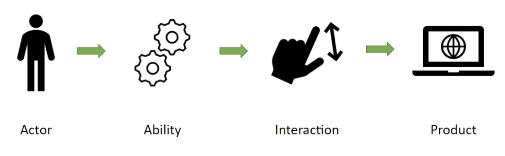

[Back to overview](../../README.md)

# Overview

The Screenplay Pattern is a design pattern for automatic interacting with software products. It can handle any type of interaction - (Web-) UI, API, etc. Test automation is the most popular use case for the pattern.

## The Design

The Screenplay Pattern can be summarized in one line: Actors use Abilities to perform Interactions. 
- **Actors**, initiate Interactions
- **Abilities**, enable Actors to initiate Interactions
- **Interactions** are procedures that exercise the behaviors under test
  - **Tasks**, executes Actions on the features under test
  - **Actions**, use Locators, Requests, etc. to interact with the features under Test
  - **Questions**, return state about the features under test

The diagram below illustrates how these parts fit together:



### Actors and Abilities

The Screenplay Pattern is a user-centric model with users and external systems interacting with the system under test represented as actors. `Actors` are a key element of the pattern as they are the ones performing the test scenarios.

Actors need `abilities` to enable them interacting with any interface of the system. How does it know how to connect your actors to those interfaces? Well, it doesn't unless you tell it, and that's where abilities come into play.

#### Defining an Actor with an Ability

For example, Alice will interact with a UI using the UseUI ability. At the same time, Bob will interact with an API using the UseAPI ability. 

```typescript
const Alice = Actor.named('Alice').can(UseUI.using(uiConfig));
const Bob = Actor.named('Bob').can(UseAPI.using(apiConfig));
```

### Tasks

`Tasks` model sequences of activities and help you capture meaningful steps of an actor workflow in your domain. Typically, tasks correspond to higher-level, business domain-specific activities like to `SignUp`, `PlaceATrade`, `TransferFunds`, and so on. 
Tasks are the core building block of the Screenplay Pattern, along with Actors, Abilities, Actions, and Questions.
To make an actor perform a task, you pass it to the attemptsTo(..) method.

```typescript
await Alice.attemptsTo(Login.toApp());
```

### Actions

`Abilities` enable actors to perform `Actions` with the system under test. `Actions` are command objects that instruct an actor how to use their abilities to perform the given activity. Most interactions you will need are already provided by Testla, and you can easily create new ones if you'd like to.

Here, we instruct Bob to use the action to send data to an API:

```typescript
const record = {
    id: 1,
    name: 'foo',
    description: 'bar',
}

await Bob.attemptsTo(Put.data(record).to('https://my.api.com/entity/1'));
```

### Questions

Apart from enabling interactions, abilities also enable actors to answer questions about the state of the system under test. 
For example, we could instruct Alice to ask if an element is visible in the UI. 

```typescript
await Alice.asks(Element.is.visible('#my-element'));
```

Even though these are the fundamental components of the Screenplay Pattern, the true power lies in how you combine and orchestrate them to create expressive, maintainable, and robust automated tests that align with your business domain. Embrace the Screenplay Pattern, and elevate your test automation to a level where tests not only validate functionality but also tell a clear and compelling story of your application's behavior.

[Back to overview](../../README.md)